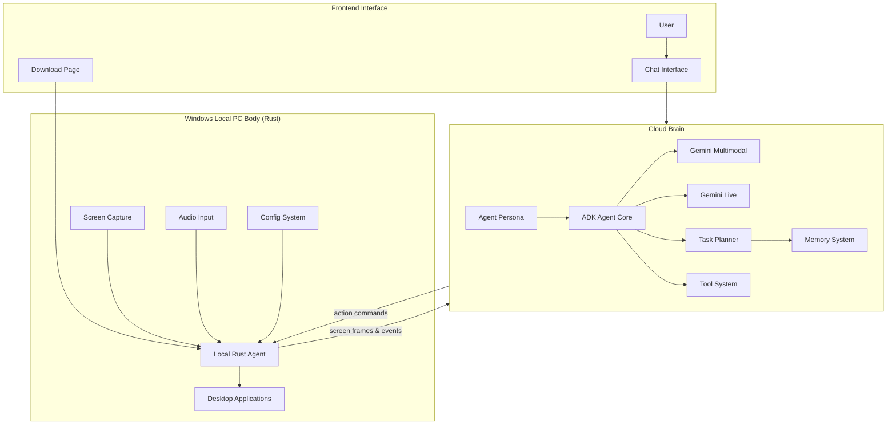
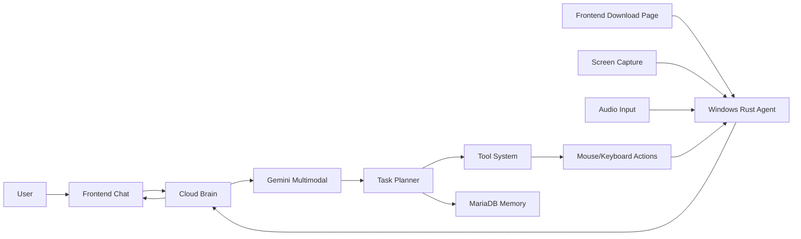

# The Intern

**PC-Embodied Autonomous AI Agent**

`pc-embodied-ai-agent : Autonomous PC-bound AI agent with real-time UI navigation and voice interaction using Gemini APIs.`

---

# Overview

**The Intern** is an **AI agent that lives inside your computer**.

It acts as your **eyes, ears, and hands** when you're away.

Instead of interacting only with APIs or isolated environments, The Intern interacts directly with **desktop applications through their graphical interfaces**, just like a human user.

You give it **high-level instructions**, and it will:

* observe the screen
* interpret the interface
* plan actions
* interact with applications
* report back with screenshots or summaries

The system combines:

* **Google Gemini multimodal reasoning**
* **Google ADK agent framework**
* **real-time screen perception**
* **desktop automation**
* **autonomous task planning**

Think of it as:

> a digital intern that can operate your computer while you're gone.

---

# Core Capabilities

## Screen Perception

The Intern continuously observes the desktop through screen capture, allowing it to:

* understand UI layouts
* detect application states
* identify buttons, menus, and messages

---

## UI Interaction

The Intern interacts with applications using:

* mouse automation
* keyboard input
* window control

Supports almost any application including:

* browsers
* messaging apps
* IDEs
* dashboards
* file managers

---

## Autonomous Task Execution

High-level goals examples:

```
Check WhatsApp and summarize unread messages
Deploy the latest build
Send screenshots of the analytics dashboard
```

The planner breaks these goals into actionable steps.

---

## Messaging & Reports

The Intern can reply with:

* text summaries
* screenshots
* annotated UI explanations
* status reports

---

## Multi-Device Operation

Multiple computers can run **local agent clients** connected to a shared cloud brain.

For the hackathon prototype we currently support:

**Windows local agents only.**

---

## AI Tool Usage

The Intern can call external AI tools for:

* code generation
* reasoning
* information retrieval
* UI interpretation

---

# Frontend

The `/frontend` folder provides **two primary interfaces**.

### Chat Interface

Located at:

```
/frontend/chat
```

Allows users to:

* talk directly with the agent
* send instructions
* receive screenshots
* view reports and summaries

---

### Download Page

Located at:

```
/frontend/download
```

Users can download the **Windows Local Agent**.

The downloaded executable runs the **Rust-based Local PC Body** that connects to the cloud brain.

---

# System Architecture

The Intern consists of **three main systems**:

1. **Frontend Interface**
2. **Windows Local PC Body (Rust Agent)**
3. **Cloud Brain**

---

# Architecture Diagram



---

# System Components

## Windows Local PC Body (Rust)

The Local Agent runs as a **native Rust application** on Windows.

Responsibilities:

* capture screen frames
* capture optional audio
* execute mouse & keyboard actions
* communicate with the cloud brain

---

### Eyes

Captures screen frames from the Windows desktop.

---

### Ears

Handles microphone input (optional).

---

### Hands

Controls:

* mouse
* keyboard
* window interaction

---

### Mouth

Handles:

* text responses
* optional voice output

---

### Local Rust Agent

Coordinates all modules and communicates with the **Cloud Brain API**.

---

## Cloud Brain

The cloud system hosts the AI reasoning components.

Modules include:

### ADK Agent Core

Responsible for:

* orchestrating reasoning
* managing tools
* executing tasks

---

### Agent Persona

Defines agent behavior:

* reporting style
* safety constraints
* decision rules

Example behaviors:

* prefer screenshots when explaining UI
* confirm destructive actions
* summarize long outputs

---

### Multimodal Reasoning

Powered by **Gemini Multimodal**.

Used to interpret:

* screenshots
* UI layouts
* visual context

---

### Dialogue Reasoning

Powered by **Gemini Live**.

Handles:

* real-time chat
* voice conversation
* interruptions

---

### Task Planner

Breaks down goals into actions.

Example:

Goal:

```
Check WhatsApp and summarize unread messages
```

Planner output:

```
1. open WhatsApp
2. detect unread chats
3. read messages
4. summarize messages
5. send report
```

---

### Tool System

Provides tools such as:

* screenshot tool
* UI control tool
* search tool
* code generation tool

---

### Memory System

The Intern maintains several memory layers.

| Memory Type       | Purpose             |
| ----------------- | ------------------- |
| Short-Term Memory | recent UI context   |
| Long-Term Memory  | tasks and knowledge |
| Vector Memory     | semantic search     |

---

# Memory Database

MariaDB stores persistent agent memory.

Example schema:

```sql
CREATE DATABASE agent_memory;

USE agent_memory;

CREATE TABLE tasks (
    id INT AUTO_INCREMENT PRIMARY KEY,
    task_name VARCHAR(255),
    status ENUM('pending','completed','in_progress'),
    created_at TIMESTAMP DEFAULT CURRENT_TIMESTAMP
);

CREATE TABLE knowledge_base (
    id INT AUTO_INCREMENT PRIMARY KEY,
    topic VARCHAR(255),
    content TEXT
);

CREATE TABLE action_logs (
    id INT AUTO_INCREMENT PRIMARY KEY,
    action_type VARCHAR(255),
    outcome TEXT,
    timestamp TIMESTAMP DEFAULT CURRENT_TIMESTAMP
);
```

---

# Configuration

Example `config.json`:

```json
{
  "apps": [
    {
      "name": "WhatsApp",
      "window_title": "WhatsApp",
      "input_mode": ["text","notifications"],
      "reply_mode": ["text","screenshots"]
    },
    {
      "name": "Discord",
      "window_title": "Discord",
      "input_mode": ["text"],
      "reply_mode": ["text"]
    }
  ],
  "screen_capture": {
    "fps": 3
  }
}
```

---

# Workflow

```
User sends instruction via chat
        |
        v
Cloud Brain interprets instruction
        |
        v
Local Rust Agent captures screen
        |
        v
Gemini analyzes UI
        |
        v
Planner generates actions
        |
        v
Local agent executes actions
        |
        v
Agent returns screenshots or reports
```

---

# System Data Flow



---

# Installation

## Requirements

* Node.js 20+
* Rust
* MariaDB
* Google Gemini API
* Google ADK

---

## Clone Repository

```bash
git clone https://github.com/yourusername/The-Intern.git
cd The-Intern
```

---

## Install Cloud Dependencies

```
npm install
```

---

## Run Cloud Brain

```
npm run start-brain
```

---

## Run Frontend

```
cd frontend
npm install
npm run start
```

---

## Run Windows Local Agent

```
cd client-rust
cargo build --release
cargo run
```

Or download the **prebuilt Windows executable** from:

```
/frontend/download
```

---

# Repository Structure

```
The-Intern/

client-rust/
 ├ Cargo.toml
 └ src/
     ├ main.rs
     ├ screen/
     ├ input/
     ├ audio/
     ├ network/
     └ executor/

cloud/
 ├ agents/
 │  ├ intern_agent.js
 │  └ persona.js
 ├ reasoning/
 ├ tools/
 ├ planner/
 ├ memory/
 └ brain_server.js

frontend/
 ├ chat/
 ├ download/
 └ index.html

config/
db/
logs/

package.json
README.md
```

---

# Security

**Hackathon Prototype**

For rapid development:

* local agents run directly on the machine
* no sandbox/container isolation
* trusted environment assumed

Production versions would include:

* sandboxed execution
* permission layers
* secure device authentication

---

# Future Roadmap

* Linux & macOS local agents
* multi-device orchestration
* reinforcement learning for UI navigation
* advanced UI element detection
* collaborative multi-agent systems
* monitoring dashboards

---

# License

MIT License
