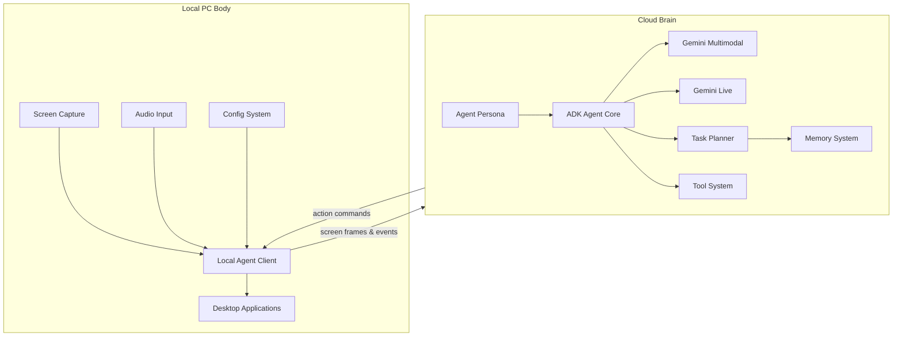

# The Intern

**PC-Embodied Autonomous AI Agent**

`pc-embodied-ai-agent : Autonomous PC-bound AI agent with real-time UI navigation and voice interaction using Gemini APIs.`

---

# Overview

**The Intern** is an **AI agent that lives inside your computer**.

It acts as your **eyes, ears, and hands** when you're away.

Instead of interacting only with APIs or isolated environments, The Intern interacts directly with **desktop applications through their graphical interfaces**, just like a human user.

You give it **high-level instructions**, and it will:

* observe the screen
* interpret the interface
* plan actions
* interact with applications
* report back with screenshots or summaries

The system combines:

* **Google Gemini multimodal reasoning**
* **Google ADK agent framework**
* **real-time screen perception**
* **desktop automation**
* **autonomous task planning**

Think of it as:

> a digital intern that can operate your computer while you're gone.

---

# Core Capabilities

## Screen Perception

The Intern continuously observes the desktop through screen capture, allowing it to:

* understand UI layouts
* detect application states
* identify buttons, menus, and messages

---

## UI Interaction

The Intern interacts with applications using:

* mouse automation
* keyboard input
* window control

Supports almost any application including:

* browsers
* messaging apps
* IDEs
* dashboards
* file managers

---

## Autonomous Task Execution

High-level goals examples:

```
Check WhatsApp and summarize unread messages
Deploy the latest build
Send screenshots of the analytics dashboard
```

The planner breaks these goals into actionable steps.

---

## Messaging & Reports

The Intern can reply with:

* text summaries
* screenshots
* annotated UI explanations
* status reports

---

## Multi-Device Operation

Multiple computers can run **local agent clients** connected to a shared cloud brain, allowing:

* remote operation
* multi-machine orchestration
* centralized reasoning

---

## AI Tool Usage

The Intern can call external AI tools for:

* code generation
* reasoning
* information retrieval
* UI interpretation

---

# Frontend

The new `/frontend` folder provides **two main features**:

1. **Chat Interface**

   * Talk directly with the agent in real time.
   * Supports text and voice input/output.

2. **Download Page**

   * Download the **Local Agent executables** for Eyes & Hands.
   * Users can install the agent locally and connect it to the cloud brain.

---

# System Architecture

The system consists of **two main components**:

1. **Local PC Body** – handles perception & execution
2. **Cloud Brain** – handles reasoning, planning, and memory

---

## Architecture Diagram



---

# System Components

## Local PC Body

Responsibilities:

* capture screen & audio
* execute UI actions
* communicate with the cloud brain

Modules:

* **Eyes** – screen capture
* **Ears** – audio input & optional STT
* **Hands** – mouse/keyboard automation
* **Mouth** – text or speech responses
* **Local Agent Client** – orchestrates local modules

---

## Cloud Brain

Handles reasoning, planning, and memory.

Modules:

* **ADK Agent Core** – orchestrates reasoning and task execution
* **Agent Persona** – defines behavior, tone, and reporting style
* **Multimodal Reasoning** – interprets screen images & UI elements
* **Dialogue Reasoning** – handles chat & voice conversation via Gemini Live
* **Task Planner** – decomposes goals into steps and schedules actions
* **Tool System** – provides tools like screenshot, code generation, search
* **Memory System** – short-term, long-term, and vector memory

---

# Memory Database

MariaDB stores persistent memory.

Example schema:

```sql
CREATE DATABASE agent_memory;

USE agent_memory;

CREATE TABLE tasks (
    id INT AUTO_INCREMENT PRIMARY KEY,
    task_name VARCHAR(255),
    status ENUM('pending','completed','in_progress'),
    created_at TIMESTAMP DEFAULT CURRENT_TIMESTAMP
);

CREATE TABLE knowledge_base (
    id INT AUTO_INCREMENT PRIMARY KEY,
    topic VARCHAR(255),
    content TEXT
);

CREATE TABLE action_logs (
    id INT AUTO_INCREMENT PRIMARY KEY,
    action_type VARCHAR(255),
    outcome TEXT,
    timestamp TIMESTAMP DEFAULT CURRENT_TIMESTAMP
);
```

---

# Configuration

Example `config.json`:

```json
{
  "apps": [
    {
      "name": "WhatsApp",
      "window_title": "WhatsApp",
      "input_mode": ["text","notifications"],
      "reply_mode": ["text","screenshots"]
    },
    {
      "name": "Discord",
      "window_title": "Discord",
      "input_mode": ["text"],
      "reply_mode": ["text"]
    }
  ],
  "screen_capture": {
    "fps": 3
  }
}
```

---

# Workflow

```
User sends instruction (via chat frontend)
        |
        v
Local PC captures screen/audio
        |
        v
Cloud brain interprets UI & plans
        |
        v
Local agent executes actions
        |
        v
Agent sends screenshots/reports back to chat frontend
```

---

# Installation

## Requirements

* Node.js 20+
* MariaDB
* Google Gemini API
* Google ADK

---

## Clone Repository

```bash
git clone https://github.com/yourusername/The-Intern.git
cd The-Intern
```

---

## Install Dependencies

```bash
npm install
```

---

## Run Services

Start **cloud brain**:

```bash
npm run start-brain
```

Start **local client**:

```bash
npm run start-client
```

Start **frontend**:

```bash
cd frontend
npm run start
```

* Chat with your agent at `/chat`
* Download local agent executable at `/download`

---

# Repository Structure

```
The-Intern/

client/
 ├ eyes/
 ├ ears/
 ├ hands/
 ├ mouth/
 ├ perception_router.js
 └ local_agent.js

cloud/
 ├ agents/
 │  ├ intern_agent.js
 │  └ persona.js
 ├ reasoning/
 │  ├ multimodal_reasoner.js
 │  └ dialogue_reasoner.js
 ├ tools/
 ├ planner/
 ├ memory/
 └ brain_server.js

frontend/
 ├ chat/        # web chat interface
 ├ download/    # local agent download page
 └ index.html

config/
 ├ config.json
 └ agent_config.json

db/
 ├ schema.sql
 └ migrations/

logs/

package.json
README.md
```

---

# Security

**Note:** Hackathon prototype – no sandboxed container execution.

* Local agents run directly on the machine
* Communication is assumed to be trusted for demo purposes
* Sensitive actions may not have full verification

---

# Future Roadmap

* multi-device orchestration
* autonomous workflow learning
* advanced UI element detection
* reinforcement learning for interactions
* collaborative multi-agent systems
* monitoring dashboards

---

# License

MIT License
