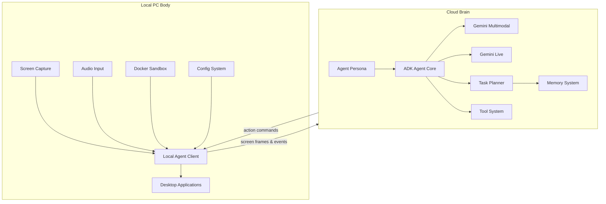
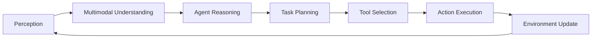
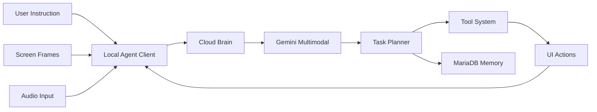

# The Intern

**PC-Embodied Autonomous AI Agent**

`pc-embodied-ai-agent : Autonomous PC-bound AI agent with real-time UI navigation and voice interaction using Gemini APIs.`

---

# Overview

**The Intern** is an **AI agent that lives inside your computer**.

It acts as your **eyes, ears, and hands** when you're away.

Instead of interacting only with APIs or isolated software environments, The Intern interacts directly with **real desktop applications through their graphical interfaces**, just like a human user.

You give it **high-level instructions**, and it will:

* observe the screen
* interpret the interface
* plan actions
* interact with applications
* report back with screenshots or summaries

The system combines:

* **Google Gemini multimodal reasoning**
* **Google ADK agent framework**
* **real-time screen perception**
* **desktop automation**
* **autonomous task planning**

Think of it as:

> a digital intern that can operate your computer while you're away.

---

# Core Capabilities

## Screen Perception

The Intern continuously observes the desktop environment through screen capture.

This allows the agent to:

* understand UI layouts
* detect application states
* identify buttons and controls
* read on-screen text
* recognize notifications

---

## UI Interaction

The Intern interacts with applications using:

* mouse automation
* keyboard input
* window control

Because it works through the **GUI layer**, it can operate almost any application including:

* browsers
* messaging apps
* IDEs
* dashboards
* file managers

---

## Autonomous Task Execution

Users can give **high-level goals**, such as:

```
Check WhatsApp and summarize unread messages
Deploy the latest build
Send screenshots of the analytics dashboard
```

The agent planner converts these goals into actionable steps.

---

## Messaging and Reports

The Intern can respond with:

* text summaries
* screenshots
* annotated UI explanations
* status reports

---

## Multi-Device Operation

Multiple computers can run **local agent clients** connected to a shared cloud brain.

This enables:

* remote operation
* multi-machine orchestration
* centralized reasoning

---

## AI Tool Usage

The Intern can call external AI tools for:

* code generation
* reasoning
* information retrieval
* UI interpretation

---

# System Architecture

The Intern consists of **two primary systems**:

1. **Local PC Body**
2. **Cloud Brain**

The local system performs **perception and execution**.

The cloud performs **reasoning, planning, and memory management**.

---

# Architecture Diagram



---

# Agent Cognition Loop

The Intern operates using a continuous **Perception → Reasoning → Planning → Action loop**.

This loop enables the agent to adapt to changing UI states.

---

## Cognition Loop Diagram



---

# System Data Flow

The following diagram shows how information moves between the local system and the cloud brain.



---

# System Components

## Local PC Body

The **local client** runs directly on the user's machine.

Responsibilities:

* capture screen data
* process audio
* execute UI actions
* communicate with the cloud brain

### Eyes

Captures screen frames and sends them to the cloud.

### Ears

Handles audio input and optional speech transcription.

### Hands

Executes actions such as:

* mouse clicks
* keyboard typing
* scrolling
* opening applications

### Mouth

Produces text or speech responses.

### Local Agent Client

Coordinates all local modules and communicates with the cloud brain.

---

## Cloud Brain

The cloud system hosts the agent's reasoning capabilities.

---

### ADK Agent

The Intern is implemented as a **Google ADK agent**, responsible for orchestrating:

* reasoning
* tool usage
* task planning

---

### Agent Persona

Defines the agent's behavioral style.

Examples:

* prefer screenshots when explaining UI
* confirm destructive actions
* provide concise reports

---

### Multimodal Reasoning

Powered by **Gemini multimodal models**.

Used to:

* analyze screenshots
* detect UI components
* interpret layout structures

---

### Dialogue Reasoning

Powered by **Gemini Live**.

Used for:

* voice communication
* conversational interaction
* interruption handling

---

### Task Planner

Responsible for:

* decomposing goals into steps
* scheduling tasks
* managing execution state

---

### Tool System

Tools extend the agent's capabilities.

Examples include:

* screenshot tool
* UI interaction tool
* search tool
* code generation tool

---

### Memory System

The Intern maintains several memory layers.

| Memory Type       | Purpose             |
| ----------------- | ------------------- |
| Short-Term Memory | recent context      |
| Long-Term Memory  | tasks and knowledge |
| Vector Memory     | semantic search     |

---

# Memory Database

MariaDB stores persistent agent memory.

Example schema:

```sql
CREATE DATABASE agent_memory;

USE agent_memory;

CREATE TABLE tasks (
    id INT AUTO_INCREMENT PRIMARY KEY,
    task_name VARCHAR(255),
    status ENUM('pending','completed','in_progress'),
    created_at TIMESTAMP DEFAULT CURRENT_TIMESTAMP
);

CREATE TABLE knowledge_base (
    id INT AUTO_INCREMENT PRIMARY KEY,
    topic VARCHAR(255),
    content TEXT
);

CREATE TABLE action_logs (
    id INT AUTO_INCREMENT PRIMARY KEY,
    action_type VARCHAR(255),
    outcome TEXT,
    timestamp TIMESTAMP DEFAULT CURRENT_TIMESTAMP
);
```

---

# Configuration

The Intern uses configuration files to define interaction behavior.

Example `config.json`:

```json
{
  "apps": [
    {
      "name": "WhatsApp",
      "window_title": "WhatsApp",
      "input_mode": ["text","notifications"],
      "reply_mode": ["text","screenshots"]
    },
    {
      "name": "Discord",
      "window_title": "Discord",
      "input_mode": ["text"],
      "reply_mode": ["text"]
    }
  ],
  "screen_capture": {
    "fps": 3
  }
}
```

---

# Workflow

```
User sends instruction
        |
        v
Local PC captures screen
        |
        v
Cloud brain interprets UI
        |
        v
Planner generates actions
        |
        v
Local agent executes actions
        |
        v
Agent returns screenshots or report
```

---

# Installation

## Requirements

* Node.js 20+
* Docker
* MariaDB
* Google Gemini API
* Google ADK

---

## Clone Repository

```
git clone https://github.com/yourusername/The-Intern.git
cd The-Intern
```

---

## Install Dependencies

```
npm install
```

---

## Start Services

```
docker-compose up -d
```

---

## Run Agent

Start local client:

```
npm run start-client
```

Start cloud brain:

```
npm run start-brain
```

---

# Repository Structure

```
The-Intern/

client/
 ├ eyes/
 ├ ears/
 ├ hands/
 ├ mouth/
 ├ perception_router.js
 └ local_agent.js

cloud/
 ├ agents/
 │  ├ intern_agent.js
 │  └ persona.js
 ├ reasoning/
 │  ├ multimodal_reasoner.js
 │  └ dialogue_reasoner.js
 ├ tools/
 ├ planner/
 ├ memory/
 └ brain_server.js

config/
 ├ config.json
 └ agent_config.json

db/
 ├ schema.sql
 └ migrations/

logs/

docker/
 └ Dockerfile

docker-compose.yml
package.json
README.md
```

---

# Security

The Intern runs inside a **sandboxed execution environment**.

Security mechanisms include:

* Docker isolation
* encrypted communication
* restricted filesystem access
* optional human confirmation for sensitive actions

---

# Future Roadmap

Planned improvements include:

* multi-device orchestration
* autonomous workflow learning
* improved UI element detection
* reinforcement learning for UI interaction
* collaborative multi-agent systems
* monitoring dashboards

---

# License

MIT License
