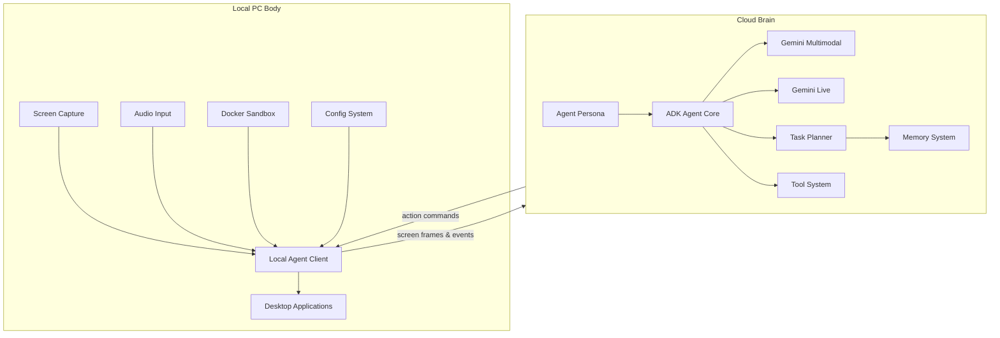

# The Intern

**PC-Embodied Autonomous AI Agent**

`pc-embodied-ai-agent : Autonomous PC-bound AI agent with real-time UI navigation and voice interaction using Gemini APIs.`

---

# Overview

**The Intern** is an **AI agent that lives inside your computer**.

It acts as your **eyes, ears, and hands** when you're away.

Instead of controlling APIs or isolated environments, The Intern interacts with **real desktop applications through the GUI**, just like a human would.

You can give it **high-level instructions**, and it will:

* observe the screen
* understand the interface
* plan actions
* interact with applications
* report back with screenshots or summaries

The Intern combines:

* **Google Gemini multimodal reasoning**
* **Google ADK agent framework**
* **real-time screen perception**
* **UI automation**
* **autonomous planning**

Think of it as:

> a digital intern that can operate your computer while you're gone.

---

# Core Capabilities

### Screen Perception

The agent continuously observes the screen using screenshots and visual context.

This allows it to:

* understand UI layouts
* detect application states
* identify buttons, menus, and messages

---

### UI Interaction

The Intern controls the machine using:

* keyboard automation
* mouse control
* window management

This enables interaction with **any GUI application**, including:

* browsers
* messaging apps
* IDEs
* file managers
* dashboards

---

### Autonomous Task Execution

Users can give **high-level goals** such as:

```
Check WhatsApp and summarize unread messages
Deploy the latest build
Send screenshots of the analytics dashboard
```

The planner decomposes these goals into actionable steps.

---

### Messaging & Reports

The agent can respond with:

* text summaries
* annotated screenshots
* UI highlights
* status reports

---

### Multi-Device Operation

Multiple computers can run **local agent clients** connected to a single cloud brain.

This allows a user to control multiple machines remotely.

---

### AI Tool Usage

The Intern can call AI tools for tasks such as:

* code generation
* searching
* reasoning
* UI analysis

---

# System Architecture

The system consists of **two major components**:

1. **Local PC Body**
2. **Cloud Brain**

The local system performs perception and execution.

The cloud performs reasoning and planning.

---

# Architecture Diagram



---

# System Components

## Local PC Body

The local client runs on the user's computer.

It is responsible for:

* capturing screen data
* listening for audio
* executing UI actions
* communicating with the cloud brain

Components include:

### Eyes

Captures the screen and sends frames to the cloud.

### Ears

Handles audio input and optional speech transcription.

### Hands

Executes UI actions such as:

* clicking
* typing
* scrolling
* launching apps

### Mouth

Produces speech or text responses.

### Local Agent Client

Coordinates all local subsystems and communicates with the cloud brain.

---

## Cloud Brain

The cloud system hosts the reasoning and planning components.

This includes:

### ADK Agent

The Intern is implemented as an **ADK agent** that orchestrates reasoning and tool usage.

### Agent Persona

The persona defines:

* behavior
* tone
* decision rules
* reporting style

Example behaviors:

* prefer screenshots when explaining UI
* confirm destructive actions
* provide concise reports

---

### Multimodal Reasoning

Powered by **Gemini multimodal models**.

Used to:

* interpret UI screenshots
* detect elements
* understand visual layouts

---

### Dialogue Reasoning

Powered by **Gemini Live**.

Used for:

* voice interaction
* real-time conversation
* interruption handling

---

### Task Planner

Responsible for:

* breaking down high-level goals
* scheduling actions
* tracking task state

---

### Tool System

Tools extend the agent's capabilities.

Examples:

* screenshot tool
* UI control tool
* search tool
* code generation tool

---

### Memory System

The Intern maintains both short and long-term memory.

| Memory Type       | Purpose                        |
| ----------------- | ------------------------------ |
| Short-Term Memory | recent screen context          |
| Long-Term Memory  | tasks, knowledge, logs         |
| Vector Memory     | embeddings for semantic search |

---

# Memory Database

Example MariaDB schema:

```sql
CREATE DATABASE agent_memory;

USE agent_memory;

CREATE TABLE tasks (
    id INT AUTO_INCREMENT PRIMARY KEY,
    task_name VARCHAR(255),
    status ENUM('pending','completed','in_progress'),
    created_at TIMESTAMP DEFAULT CURRENT_TIMESTAMP
);

CREATE TABLE knowledge_base (
    id INT AUTO_INCREMENT PRIMARY KEY,
    topic VARCHAR(255),
    content TEXT
);

CREATE TABLE action_logs (
    id INT AUTO_INCREMENT PRIMARY KEY,
    action_type VARCHAR(255),
    outcome TEXT,
    timestamp TIMESTAMP DEFAULT CURRENT_TIMESTAMP
);
```

---

# Configuration

Configuration defines which applications the agent interacts with.

Example `config.json`:

```json
{
  "apps": [
    {
      "name": "WhatsApp",
      "window_title": "WhatsApp",
      "input_mode": ["text","notifications"],
      "reply_mode": ["text","screenshots"]
    },
    {
      "name": "Discord",
      "window_title": "Discord",
      "input_mode": ["text"],
      "reply_mode": ["text"]
    }
  ],
  "screen_capture": {
    "fps": 3
  }
}
```

---

# Workflow

```text
User sends instruction
        |
        v
Local PC captures screen
        |
        v
Cloud brain interprets UI
        |
        v
Planner generates actions
        |
        v
Local agent executes actions
        |
        v
Agent sends report or screenshots
```

---

# Installation

### Requirements

* Node.js 20+
* Docker
* MariaDB
* Google Gemini API
* Google ADK

---

### Clone Repository

```bash
git clone https://github.com/yourusername/The-Intern.git
cd The-Intern
```

---

### Install Dependencies

```bash
npm install
```

---

### Start Services

```bash
docker-compose up -d
```

---

### Run Agent

Start local client:

```bash
npm run start-client
```

Start cloud brain:

```bash
npm run start-brain
```

---

# Repository Structure

```
The-Intern/

client/
 ├ eyes/
 ├ ears/
 ├ hands/
 ├ mouth/
 ├ perception_router.js
 └ local_agent.js

cloud/
 ├ agents/
 │  ├ intern_agent.js
 │  └ persona.js
 ├ reasoning/
 │  ├ multimodal_reasoner.js
 │  └ dialogue_reasoner.js
 ├ tools/
 ├ planner/
 ├ memory/
 └ brain_server.js

config/
 ├ config.json
 └ agent_config.json

db/
 ├ schema.sql
 └ migrations/

logs/

docker/
 └ Dockerfile

docker-compose.yml
package.json
README.md
```

---

# Security

The Intern runs in a sandboxed environment.

Security features include:

* Docker isolation
* encrypted communication
* limited filesystem access
* optional human approval for sensitive actions

---

# Future Roadmap

Planned improvements:

* multi-device orchestration
* autonomous workflow learning
* advanced UI element detection
* reinforcement learning for interaction strategies
* agent collaboration
* cloud dashboards for monitoring

---

# License

MIT License
